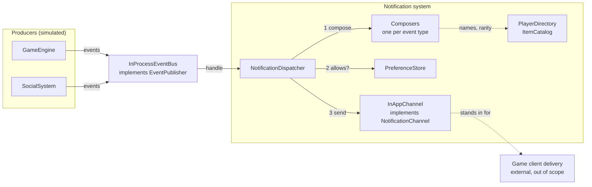
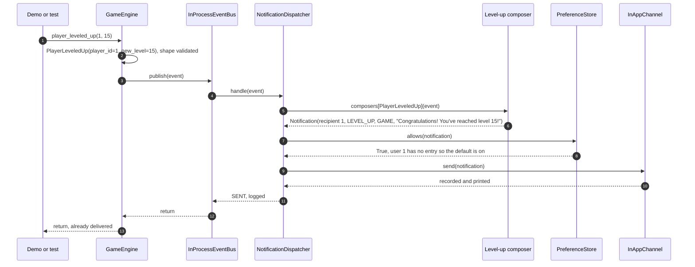

# Architecture: Real-Time Notification System

**Status:** Approved 2026-10-06.
**Input:** [REQUIREMENTS.md](REQUIREMENTS.md), approved 2026-10-06. FR-, A- and T- references point there.
**Implementation order:** [PLAN.md](PLAN.md).

---

## 1. Approaches considered

All three approaches share the same edges: simulated producers, one `Notification` built per event, a preference check, and a mocked in-app channel. They differ in how an event travels from a producer to the notification logic.

### A. Direct service calls

Each producer holds a `NotificationService` and calls one method per event, e.g. `notifications.notify_level_up(player_id, level)`. The service formats the notification, checks preferences, and sends it.

| Pros | Cons |
|---|---|
| Least code, and one obvious call path. | The producers know the notification system exists, so the game engine is coupled to notifications. |
| Synchronous and deterministic. | Every new event type adds a method to the service and a call in the producer, so each addition edits existing classes. |
| | A second consumer of the same event (analytics, achievements) means editing the producers again. |
| | There's no seam for a broker, so the distributed setup (§3d) means rewriting every call site. |
| | It doesn't match the spec's framing of events "emitted by different parts of the game platform" that you "capture". |

### B. In-process synchronous event bus (chosen)

Producers build immutable event objects and `publish` them to an `EventPublisher`. A `NotificationDispatcher` subscribes and runs the spec's pipeline: compose, check preferences, send. Each event type has a small *composer* that turns the event into a `Notification`.

| Pros | Cons |
|---|---|
| Producers depend only on the event types and a one-method publisher interface. | One level of indirection: to see which code handles an event, you look at the composer registry. |
| A new event type is a new event, a new composer, and one registry line. The dispatcher, bus, preferences, and channels stay untouched (§3a). | Delivery runs on the producer's call stack, so a slow channel slows the caller. That's harmless with a mock client, and it's handled in §3b/§3d once it matters. |
| Events are plain data, so the bus can be swapped for a broker without touching producers or the dispatcher (§3d). | Slightly more code than A: a ~15-line bus plus a registry. |
| Synchronous, so `player_leveled_up(1, 15)` returns after the notification is delivered. Demo output is deterministic and tests stay simple. This is the agreed meaning of "real-time" (A-15). | |

### C. Asynchronous queue and worker (asyncio or a thread)

Producers put events on a queue, and a worker task consumes and dispatches them.

| Pros | Cons |
|---|---|
| Producers never wait for delivery. | Concurrency with nothing to gain: delivery is a mock that prints, so there's no I/O to overlap. |
| Buffering and backpressure. | It brings event-loop lifecycle, draining the queue before exit, error propagation out of the worker, and nondeterministic output ordering. |
| Closest to how a production consumer behaves. | Tests need async fixtures or explicit draining. |
| | Producers would have to become `async` or bridge threads, but the spec's calls are synchronous. |

**Verdict on C:** overengineering at this scope. It becomes the right shape once delivery does real I/O, and B migrates to it without touching composers.

### Recommendation

**B.** It's the smallest design that fits the spec's event-emitting framing and keeps all four extension scenarios in §3 cheap. A is simpler but turns every extension into an edit to existing classes. C buys nothing until delivery does real I/O.

---

## 2. Design

### 2.1 Overview



### 2.2 Components

| Component | Module | Responsibility |
|---|---|---|
| Events | `events.py` | Immutable facts emitted by producers, one frozen dataclass per event type. Each validates its own shape on construction (A-18). |
| `GameEngine`, `SocialSystem` | `producers.py` | Simulated producers. Each spec-named method (snake_case, A-4) builds an event and publishes it. No business logic. |
| `EventPublisher`, `InProcessEventBus` | `bus.py` | Carry events from producers to subscribers, synchronously and in order. Isolate producers from subscriber failures (DEC-7). |
| `NotificationDispatcher` | `dispatcher.py` | The spec's pipeline in one place: pick the composer for the event's type, build the `Notification`, check preferences, send it to the channels. Logs and returns the outcome. |
| Composers | `composers.py` | One per event type. Each decides the recipient, type, category, and message, or returns `None` if the event shouldn't notify anyone (a common or unknown item, A-5). The message templates and the event-type registry live here. |
| `PlayerDirectory`, `ItemCatalog` | `lookups.py` | In-memory lookups for display names and item name/rarity (A-5, A-8). |
| `Notification`, `NotificationType`, `Category` | `notification.py` | The object we deliver (A-1). |
| `PreferenceStore`, `InMemoryPreferenceStore` | `preferences.py` | Per-user, per-category on/off switches, on by default (A-12, A-13). |
| `NotificationChannel`, `InAppChannel` | `channels.py` | Hand a notification to the client. `InAppChannel` simulates the platform's existing real-time mechanism: it records each notification and prints it. |
| `build_app()` | `app.py` | Composition root: builds every component, wires them together, and seeds the demo players and items. |
| Demo | `__main__.py` | The example-usage scenario (FR-15), run with `python -m notifications`. |

### 2.3 Interfaces

These are signatures only; method bodies aren't designed here. `Protocol` is used only at the three swap points (DEC-9).

```python
# events.py
@dataclass(frozen=True)
class Event: ...                                   # marker base class

@dataclass(frozen=True)
class PlayerLeveledUp(Event):
    player_id: int
    new_level: int
# Also: ItemAcquired(player_id, item_id), ChallengeCompleted(player_id, challenge_name),
#       PlayerAttacked(attacker_id, victim_id), PlayerDefeated(winner_id, loser_id),
#       FriendRequestSent(sender_id, recipient_id), FriendRequestAccepted(accepter_id, requester_id),
#       PlayerFollowed(follower_id, followed_id)
# Each raises ValueError from __post_init__ when its shape is invalid.

# bus.py
class EventPublisher(Protocol):
    def publish(self, event: Event) -> None: ...

class InProcessEventBus:                           # satisfies EventPublisher
    def subscribe(self, handler: Callable[[Event], object]) -> None: ...
    def publish(self, event: Event) -> None: ...   # calls every handler in order; logs and isolates failures

# notification.py
class Category(Enum):          GAME = "Game Events"; SOCIAL = "Social Events"
class NotificationType(Enum):  LEVEL_UP, ITEM_ACQUIRED, CHALLENGE_COMPLETED, PLAYER_ATTACKED,
                               PLAYER_DEFEATED, FRIEND_REQUEST, FRIEND_ACCEPTED, NEW_FOLLOWER

@dataclass(frozen=True)
class Notification:
    recipient_id: int
    type: NotificationType
    category: Category
    message: str
    data: Mapping[str, object]                     # e.g. {"level": 15}; read-only copy (DEC-15)
    id: str                                        # defaults to a uuid4
    created_at: datetime                           # defaults to now, UTC

# composers.py
Composer = Callable[[Event], Notification | None]  # None means "don't notify"
def default_composers(players: PlayerDirectory, items: ItemCatalog) -> dict[type[Event], Composer]: ...

# lookups.py
class PlayerDirectory:  def display_name(self, player_id: int) -> str: ...       # unknown id -> str(id)
class ItemCatalog:      def lookup(self, item_id: str) -> ItemInfo | None: ...   # ItemInfo(name, rarity)

# preferences.py
class PreferenceStore(Protocol):
    def allows(self, notification: Notification) -> bool: ...

class InMemoryPreferenceStore:                     # satisfies PreferenceStore
    def set_enabled(self, user_id: int, category: Category, enabled: bool) -> None: ...
    def allows(self, notification: Notification) -> bool: ...   # no entry -> True

# channels.py
class NotificationChannel(Protocol):
    def send(self, notification: Notification) -> None: ...

class InAppChannel:                                # satisfies NotificationChannel
    delivered: list[Notification]
    def send(self, notification: Notification) -> None: ...     # record, then print

# dispatcher.py
class DispatchOutcome(Enum):  SENT, FAILED, SUPPRESSED, IGNORED

class NotificationDispatcher:
    def __init__(self, composers: Mapping[type[Event], Composer],
                 preferences: PreferenceStore,
                 channels: Sequence[NotificationChannel]) -> None: ...
    def handle(self, event: Event) -> DispatchOutcome: ...

# producers.py
class GameEngine:
    def __init__(self, publisher: EventPublisher) -> None: ...
    def player_leveled_up(self, player_id: int, new_level: int) -> None: ...
    def item_acquired(self, player_id: int, item_id: str) -> None: ...
    def challenge_completed(self, player_id: int, challenge_name: str) -> None: ...
    def player_attacked(self, attacker_id: int, victim_id: int) -> None: ...
    def player_defeated(self, winner_id: int, loser_id: int) -> None: ...

class SocialSystem:
    def __init__(self, publisher: EventPublisher) -> None: ...
    def friend_request_sent(self, sender_id: int, recipient_id: int) -> None: ...
    def friend_request_accepted(self, accepter_id: int, requester_id: int) -> None: ...
    def player_followed(self, follower_id: int, followed_id: int) -> None: ...

# app.py
def build_app() -> App: ...   # App exposes game_engine, social_system, preferences, in_app
```

### 2.4 Flow: `game_engine.player_leveled_up(1, 15)`

1. `GameEngine.player_leveled_up(1, 15)` builds `PlayerLeveledUp(player_id=1, new_level=15)`. The event validates its shape, so an invalid id or a level below 1 raises here, at the caller.
2. The engine calls `publisher.publish(event)`. The publisher is the `InProcessEventBus`.
3. The bus calls each subscriber in turn. The only subscriber is `NotificationDispatcher.handle`.
4. The dispatcher looks up `composers[PlayerLeveledUp]`.
5. The level-up composer returns `Notification(recipient_id=1, type=LEVEL_UP, category=GAME, message="Congratulations! You've reached level 15!", data={"level": 15})`.
6. The dispatcher asks `preferences.allows(notification)`. User 1 has no entry, so the default (on) applies and the answer is `True`.
7. The dispatcher calls `InAppChannel.send(notification)`, which records the notification and prints it.
8. The dispatcher logs `SENT` and returns. Control unwinds back to the caller of `player_leveled_up`, and by then the notification has already been delivered.



The other triggers take the same path. Only the composer differs, along with whose preferences get checked: always the **recipient's**, e.g. user 1 for T3 and user 3 for T4.

### 2.5 Error handling and logging

| Situation | Behaviour | Outcome |
|---|---|---|
| Invalid event shape | `ValueError` raised at the producer call, before anything is published | (raises) |
| No composer registered for the event type | Warning logged | `IGNORED` |
| Composer returns `None` (common or unknown item) | Info logged | `IGNORED` |
| Recipient has the category disabled | Info logged; the notification is discarded (A-14) | `SUPPRESSED` |
| A channel raises | Error logged with the notification id; the remaining channels still run (A-17) | `FAILED` only if every channel raised, otherwise `SENT` |
| A subscriber raises, e.g. a composer bug propagating out of `handle` | The bus logs `Subscriber {name} failed on {EventClass}` at ERROR with the traceback, then runs the remaining subscribers. The producer's call returns normally. | (none: `handle` didn't return) |

There are two error boundaries (DEC-7):
- **The bus** is the boundary between producers and the notification system. It catches any exception a subscriber raises, logs it, and carries on, so a notification bug never breaks `game_engine.player_leveled_up()`.
- **The dispatcher** catches only delivery errors from channels. A composer bug propagates out of `handle` to the bus, where it's logged with its traceback rather than silently turned into an outcome.

Invalid events still raise at the producer: validation runs when the event is built, before `publish()` is called.

---

## 3. Extension walkthrough

Each scenario is followed by a callout of the **edits to existing code** it forces.

### (a) Add a new event type

Example: a guild invite, `social_system.guild_invite_sent(inviter_id, invitee_id)`.

| Change | Where | Edits existing code? |
|---|---|---|
| `GuildInviteSent` event dataclass | `events.py` | No. It's a new class in an existing module. |
| `NotificationType.GUILD_INVITE` | `notification.py` | **Yes:** one enum member. |
| Composer function, plus one entry in `default_composers()` | `composers.py` | **Yes:** one registry line. |
| `guild_invite_sent()` method | `producers.py` | **Yes:** a simulator method. On a real platform this is the producing team's code, not ours. |
| Composer unit test and acceptance test | `tests/` | No. |

**Untouched:** the bus, dispatcher, preferences, channels, and `app.py`. A new *category* (e.g. "Guild Events") is one more `Category` member, and default-on preferences cover it without changing the store.

**Callout:** three one-line edits, none of them in a class that carries behaviour. The enum edits are deliberate: with a closed set of types, a typo fails at import time. Free-form strings would avoid the edit but lose that check.

### (b) Add a push or email channel

**Simple case: every notification goes to every channel.**

| Change | Where | Edits existing code? |
|---|---|---|
| `EmailChannel` or `PushChannel` implementing `send()` | new module | No. |
| Add it to the channel list | `app.py` | **Yes:** wiring only. |

**Realistic case: these force edits.**
- **Users choose channels**, e.g. "social events by email, game events in-app only". Preferences then need a channel dimension, so `allows(notification)` becomes `allows(notification, channel)`. **This edits the `PreferenceStore` protocol, `InMemoryPreferenceStore`, and the dispatcher's send loop.** It isn't designed in now, since it isn't needed until there's a second channel (§6).
- **Channel-specific content.** An email needs a subject and an address. The subject and body can be formatted from `Notification.data` inside the channel, which is why `data` is structured. The address needs `PlayerDirectory.email()`, **an edit**.
- **Latency and failures.** Email and push are slow and fail intermittently, so sending on the producer's call stack stops being acceptable. Delivery has to move off the call path (approach C, or §3d), with retries. This is the real cost of a new channel, more than the class itself.

### (c) Add per-event-type preferences

Example: "notify me about friend requests but not new followers".

| Change | Where | Edits existing code? |
|---|---|---|
| Store per-type overrides, resolved in order: type setting, then category setting, then default on | `InMemoryPreferenceStore` | **Yes:** the store. |
| `set_type_enabled(user_id, type, enabled)` setter | `InMemoryPreferenceStore` | **Yes:** the store. |
| Tests | `tests/` | No. |

**Untouched:** the dispatcher, composers, and channels. That's because `allows()` already receives the whole `Notification`, which carries `type` as well as `category` (DEC-5). With an `is_enabled(user_id, category)` signature, the dispatcher would have to change too.

### (d) Move to a distributed setup with a message broker

Target shape: producers publish to a broker topic. Notification-service instances consume it and push to a real-time gateway (WebSockets), which holds the client connections.

| Change | Where | Edits existing code? |
|---|---|---|
| `BrokerEventPublisher` implementing `EventPublisher`: serialize, publish, partition by recipient id | new module | No. Producers are unchanged. |
| Event serialization: a type tag plus the dataclass fields, to JSON and back | new module | No. Events are already plain data. |
| Consumer entry point: read, deserialize, `dispatcher.handle(event)`, ack. Plus a second composition root. | new modules | No. The dispatcher and composers are reused as they are. |
| DB-backed `PreferenceStore`; service clients for the player directory and item catalog | new modules | No. They satisfy the protocol or match the duck type. |
| An in-app channel that publishes to the gateway node holding the player's connection | new channel | No. |
| `event_id` and `occurred_at` on every event, for idempotency and ordering | `events.py` (the `Event` base, with kw-only fields) | **Yes:** the event base class. |
| Error policy changes from log-and-continue to raise, so the consumer can retry or nack. Dedupe on `event_id`. | `dispatcher.py` | **Yes:** the dispatcher. |

**Callout:** the bus seam makes moving the *code* cheap. The real work is the *semantics* that an in-process call provides for free:
- At-least-once delivery means duplicates, which means idempotency.
- Retries and a dead-letter queue.
- Per-player ordering.
- Offline players, which need an inbox store.
- Routing to whichever gateway node holds the player's connection.

Tests that assume a notification was delivered by the time `player_leveled_up()` returns hold only for the in-process bus. The dispatcher and composer unit tests stay valid.

### Summary

| Scenario | Existing code edited | Behavioural classes untouched |
|---|---|---|
| (a) New event type | `NotificationType`, `default_composers()`, simulator | dispatcher, bus, preferences, channels |
| (b) New channel, sent to everyone | `app.py` wiring | everything |
| (b) New channel, chosen per user | `PreferenceStore` protocol and implementation, dispatcher | composers, bus, producers |
| (c) Per-type preferences | `InMemoryPreferenceStore` | dispatcher, composers, channels |
| (d) Broker | `Event` base class, dispatcher error policy | producers, composers, preference protocol |

---

## 4. Folder structure

```
.
├── build.sh                 # find Python ≥ 3.11 (DEC-16), create .venv, pip install -e ".[dev]", compileall
├── run.sh                   # .venv/bin/python -m notifications
├── test.sh                  # .venv/bin/python -m pytest
├── pyproject.toml           # metadata, "dev" extra (pytest), pytest config
├── README.md
├── CLAUDE.md
├── .gitignore               # .venv/, __pycache__/, *.pdf
├── docs/
│   ├── REQUIREMENTS.md
│   ├── ARCHITECTURE.md
│   ├── PLAN.md
│   └── AI_PROCESS.md
├── src/notifications/
│   ├── __init__.py
│   ├── __main__.py          # demo scenario (FR-15)
│   ├── app.py               # build_app(): composition root and demo seed data
│   ├── events.py
│   ├── producers.py
│   ├── bus.py
│   ├── notification.py
│   ├── composers.py
│   ├── lookups.py
│   ├── preferences.py
│   ├── channels.py
│   └── dispatcher.py
└── tests/
    ├── conftest.py          # app fixture; RecordingChannel and FailingChannel fakes
    ├── test_notification.py
    ├── test_events.py
    ├── test_composers.py
    ├── test_lookups.py
    ├── test_channels.py
    ├── test_preferences.py
    ├── test_dispatcher.py
    ├── test_bus.py
    ├── test_acceptance.py   # the spec's triggers, end to end
    ├── test_build_script.py # build.sh interpreter discovery (DEC-16)
    └── test_demo.py         # smoke test of the run command
```

- The package is flat, with one module per component (DEC-12).
- The `src/` layout means tests run against the installed package rather than whatever happens to be in the working directory.
- `*.pdf` in `.gitignore` enforces D-6.

---

## 5. Test strategy

- **Test-first, outside-in.** Each feature starts with a failing acceptance test for its trigger (e.g. T1). Unit tests then drive the event, composer, and dispatcher until the acceptance test passes.
- **Real in-memory components instead of mocks.** The bus, preferences, directory, and catalog are already in-memory, so tests use the real ones. Only channels get test doubles: `RecordingChannel`, which appends to a list, and `FailingChannel`, which raises. No mocking library is needed.
- **The spec's example messages are asserted verbatim** for T1–T3, since they're acceptance criteria.

| Layer | File | What it proves |
|---|---|---|
| Unit | `test_events.py` | Shape validation: non-positive ids, level below 1, empty names, and actor equal to recipient for social and PvP events. |
| Unit | `test_composers.py` | For each event type: the recipient, type, category, and message. T1–T3 messages match verbatim. T4's recipient is the requester. PvP notifies the victim or loser. Common and unknown items produce `None`. An unknown player id falls back to the id. |
| Unit | `test_notification.py`, `test_lookups.py`, `test_channels.py` | Notification defaults and immutability; name and item lookups with their fallbacks; the in-app channel's recording and output format. |
| Unit | `test_preferences.py` | On by default. Disabling and re-enabling a category. Categories are independent of each other, and so are users. |
| Unit | `test_dispatcher.py` | `SENT`. `SUPPRESSED` uses the **recipient's** preferences, not the actor's. `IGNORED` for an unregistered event and for a `None` composer. A failing channel is logged, gives `FAILED`, and the next event still goes through. Every channel receives the notification. |
| Unit | `test_bus.py` | Every subscriber receives each event, in order. Publishing with no subscribers does nothing. |
| Acceptance | `test_acceptance.py` | Runs through `build_app()` and the producers. Covers the four spec triggers exactly as written, plus challenge, follow, attack, defeat, and one suppression. Asserts both who received what and who received nothing. |
| Script | `test_build_script.py` | `build.sh` picks the newest interpreter that is 3.11 or newer, judges candidates by version rather than name, and honours `PYTHON`. When nothing qualifies, it fails with a message listing what it found. Fake interpreters on a controlled `PATH` keep these tests fast and offline. |
| Smoke | `test_demo.py` | `python -m notifications` exits 0 and prints the T1–T4 messages, so the run command can't silently break. |

**Not doing:** coverage gates, property-based tests, or mutation testing. These are fine on a production codebase but add noise here. A possible extra if time allows: `mypy` and `ruff` in the build. That's a suggestion only, not planned.

---

## 6. Proportionality

### Deliberately not built (overengineering at this scope)

| Not building | Why |
|---|---|
| Async queue and worker (approach C) | There's no I/O to overlap, and it adds lifecycle handling and nondeterminism. |
| A real broker, WebSocket server, or Docker | Out of scope (A-15), and the graders would have to run the infrastructure. |
| A DI container, plugin discovery, or decorator auto-registration | An explicit dict in `default_composers()` is easier to read and debug. |
| Layered packages (`domain/`, `application/`, `infrastructure/`) | There are about 11 modules. Extra folders would add navigation without adding separation. |
| Protocols for `PlayerDirectory` and `ItemCatalog` | Each has one implementation, and duck typing lets a real client drop in later. |
| A separate "client gateway" class behind `InAppChannel` | The channel already is the boundary, so another layer would only pass calls through. |
| A template engine, external message files, or i18n | There are 8 f-strings. |
| Per-channel preferences or a channel router | Not needed until there's a second channel (§3b). |
| `event_id`, timestamps, or schema versions on events | These only matter with a broker (§3d). |
| Retries and backoff | There's nothing to retry against a mock. |
| Bus features: topics, wildcards, priorities, unsubscribe | The bus has one subscriber. |
| Thread safety | The design is single-threaded. |

### Borderline choices kept

| Choice | Cost | Why keep it |
|---|---|---|
| A publisher and bus instead of direct calls | About 15 lines | It fits the spec's "events emitted by different parts of the platform", and it's the seam for §3d. |
| A list of channels instead of one channel | One line | A new channel becomes wiring-only (§3b). |
| `allows(notification)` instead of `(user_id, category)` | None | Per-type preferences become a store-only change (§3c). |
| A `DispatchOutcome` return value | A small enum | Tests can assert *why* nothing was sent, not just that nothing was. |

---

## 7. Decisions

| ID | Decision | Alternatives considered | Why |
|---|---|---|---|
| DEC-1 | Use an in-process synchronous event bus. | Direct service calls; async queue and worker | See §1. It's the smallest design that matches the spec's framing and keeps every extension cheap. |
| DEC-2 | The bus broadcasts every event, and the dispatcher routes by event type through a composer registry. | The bus routes by type, with one subscription per event type; `functools.singledispatch` | This keeps the spec's four-step pipeline in one class. The bus stays a plain pipe that maps to one broker topic. `singledispatch` hides the registry inside decorators. |
| DEC-3 | Composers are separate from events. | `event.to_notification()` | Events are facts owned by the producers. Wording, recipients, and lookups are the notification system's concern. Keeping them apart also keeps events serializable plain data. |
| DEC-4 | Create the `Notification` first, then check preferences. | Check first and skip creation | This follows the spec's stated order (A-14), and the log can show what was suppressed. The cost is negligible. |
| DEC-5 | `PreferenceStore.allows(notification)` | `is_enabled(user_id, category)` | Same code today, but per-type preferences become a store-only change (§3c). |
| DEC-6 | The dispatcher sends to a sequence of channels. | A single channel | It's one line, and new channels become wiring-only (§3b). |
| DEC-7 | Two error boundaries. The bus catches any exception a subscriber raises, logs it at ERROR with the traceback (naming the subscriber and the event class), and runs the remaining subscribers. Inside the dispatcher, only channel errors are caught (A-17); composer errors propagate to the bus. Event validation still raises at the producer, because it runs before `publish()`. | Let subscriber exceptions propagate to the producer (the original DEC-7); catch everything in the dispatcher; retries | The bus exists so producers don't depend on the notification system. If a notification bug can break `game_engine.player_leveled_up()`, that independence is gone. Catching at the bus keeps the game's call safe and leaves other subscribers unaffected, and the dispatcher doesn't hide composer bugs behind an outcome. **Revised at checkpoint 1**, at the user's request: originally the bus caught nothing, on the grounds that it had a single subscriber. |
| DEC-8 | Shape validation lives in each event's `__post_init__`. There are no social-state checks. | Validating in the dispatcher; mirroring the social graph | See A-18. Invalid events then fail at the producer call, which is where the bug is. |
| DEC-9 | Use `Protocol` only at the three swap points: `EventPublisher`, `PreferenceStore`, `NotificationChannel`. | ABCs; protocols everywhere | These are the swap points in §3. A protocol is structural, so in-memory classes and test fakes satisfy it without inheriting from it. |
| DEC-10 | Our own frozen `Notification` carries `type`, `category`, and `data` as well as `message`. | A message-only notification | See A-1. Future channels can format from the structured data. |
| DEC-11 | The dispatcher returns a `DispatchOutcome` and logs each decision through `logging`. | Logging only; observer hooks | Tests can assert the reason, and the demo shows the log lines. |
| DEC-12 | A flat `src/notifications/` package with one module per component. | Layered subpackages; a single module | Proportionate to the size (§6). |
| DEC-13 | Message templates are f-strings inside the composers. | Template files; an i18n catalog | There are 8 messages, and they can all be read in one place. |
| DEC-14 | The demo seed data (players and items) are defaults in `build_app()`. | A separate seed module; a data file | The demo and the acceptance tests share it, and it saves a file. |
| DEC-15 | `Notification.data` is stored as a read-only `MappingProxyType` over a shallow copy of the input, set in `__post_init__`. | Keep the caller's dict (frozen dataclasses don't freeze their contents); `frozendict` (a third-party dependency); a tuple of pairs (awkward to read) | Makes the notification immutable in practice, not just at the attribute level: no channel can alter what another channel sees, and the caller's later changes don't leak in. It uses only the standard library. The copy is shallow, so nested mutable values would still be mutable; every payload we build holds only primitives. Added at the user's request during plan review. **Revised at checkpoint 1:** a mapping proxy isn't hashable, so the generated `__hash__` made `hash(notification)` raise `TypeError`. `data` is now declared with `field(hash=False)`: it's left out of the hash but still compared for equality, so equal notifications still hash equally and notifications can go in sets and dict keys. |
| DEC-16 | When `PYTHON` isn't set, `build.sh` uses `python3` if it reports 3.11 or newer. Otherwise it uses the newest `python3.N` on `PATH` that does. Candidates are found with `compgen -c`, so there is no fixed list, and names like `python3.12-config` are skipped. Each is judged by the version it reports, not its name. The choice is printed when `.venv` is created. `PYTHON` still overrides discovery, and an override that is too old is an error rather than a silent fallback. | Use `python3` only and ask graders to set `PYTHON` (the original); a fixed list of names (the first fix, which missed a machine with only `python3.14`); use `uv` or `pyenv` to fetch a Python (a new tool dependency); support 3.9 | On a stock Mac `python3` is 3.9, so the original build failed unless the grader knew to set `PYTHON`. `python3` comes first because it's the machine's default, so it's the most likely to have venv and pip working. The version is parsed in bash so the check works with any interpreter. Covered by `tests/test_build_script.py`, which uses fake interpreters on a controlled `PATH` (no venv, no pip). **Why 3.11 is the minimum (S7):** Python 3.9 has been end of life since October 2025. Also, the pip bundled with the stock macOS Python 3.9.6 (pip 21.2.4) can't do the editable install. I verified this: `pip install -e .` on a pyproject-only project fails with "File \"setup.py\" or \"setup.cfg\" not found", because that needs pip 21.3 or newer. When nothing qualifies, the error lists what was found and how to install a Python: Homebrew or the python.org installer on macOS, apt on Debian/Ubuntu. Added at checkpoint 3; reworked after the full-repo review (S1, S7). |
